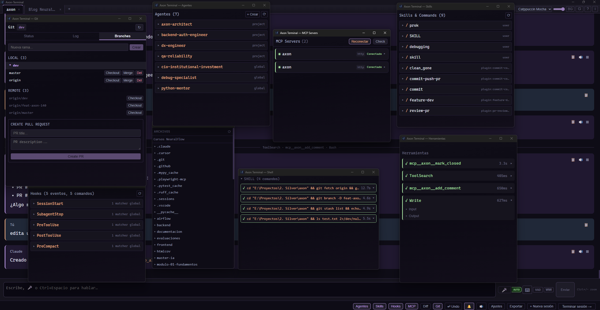
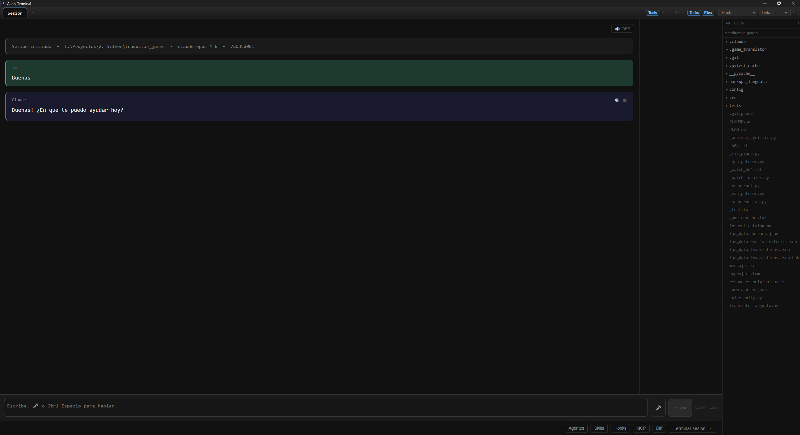
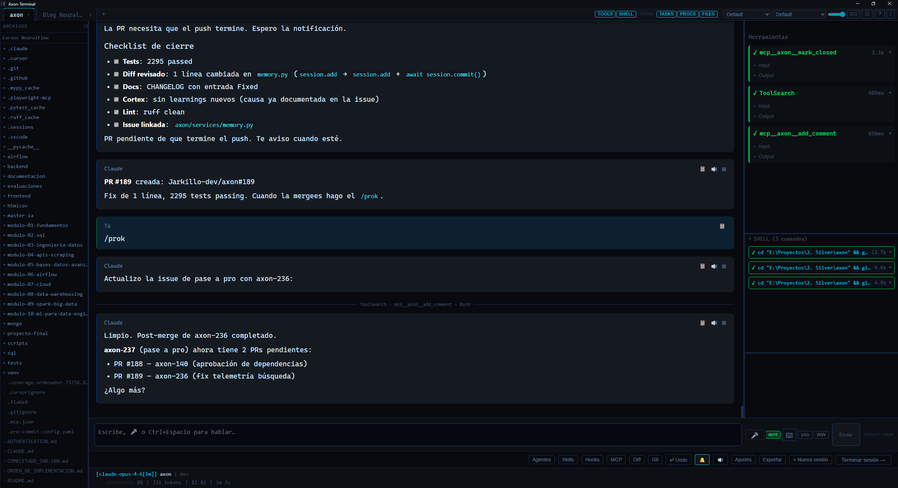

  

<h1 align="center">Axon Terminal</h1>

  Terminal GUI para Claude Code. Ve todo lo que pasa, sin perder contexto haciendo scroll.

  <a href="https://terminal.neuralflow.es">Web</a> &middot;
  <a href="https://github.com/Neuralflows/axon-terminal/releases">Descargar</a> &middot;
  <a href="#features">Features</a> &middot;
  <a href="#changelog">Changelog</a>

---

## Que es

Axon Terminal es una aplicacion de escritorio que reemplaza la CLI de Claude Code por una interfaz visual con paneles especializados. Construida con Tauri 2 (Rust) + React (TypeScript).

Claude Code es potente, pero en la terminal pierdes contexto constantemente: scroll infinito, output mezclado, y cero visibilidad de lo que esta pasando. Axon Terminal separa cada flujo de informacion en su propio panel para que siempre sepas que esta haciendo Claude con tu codigo.

## Features

**Paneles separados para todo** — Conversacion, herramientas, shell, thinking, tareas, diff, arbol de archivos, agentes, skills, hooks, MCP. Cada cosa en su sitio, todo visible a la vez.

**StatusLine siempre visible** — Modelo, proyecto, rama git, barra de progreso de contexto, tokens usados, coste acumulado y duracion. Sin sorpresas en la factura.

**Diff side-by-side en tiempo real** — Ve exactamente que esta tocando Claude en tu codigo mientras lo hace, no despues.

**Multi-tab** — Trabaja en varios proyectos en la misma ventana. Abre tabs con Ctrl+T, navega con Ctrl+Tab o Ctrl+1..9.

**Ventanas flotantes** — Extrae cualquier panel como ventana independiente always-on-top. Ideal para monitores grandes o multi-pantalla.

**Temas** — 11 temas oscuros + 2 claros. Fuentes configurables (Cascadia Code, JetBrains Mono, Fira Code, etc.).

**Historial de sesiones** — Cierra la app y vuelve manana. Tus sesiones se guardan y puedes reanudarlas con todo el contexto.

**Arbol de archivos con git status** — M/A/D en vivo. Click para ver el diff de cualquier archivo que Claude haya tocado.

**Voz** — Push-to-talk configurable para dar instrucciones por voz. Tecla configurable, auto-envio opcional.

**Busqueda en conversacion** — Ctrl+F para encontrar lo que Claude dijo hace 50 mensajes.

**Exportar a Markdown** — Guarda cualquier conversacion como archivo .md con un click.

**Notificaciones de escritorio** — Sigue con otra cosa mientras Claude trabaja. Te avisa cuando termina.

**Atajos de teclado** — F11 fullscreen, Ctrl+F buscar, Ctrl+T nueva tab, Ctrl+W cerrar tab, y mas.

**Modelos** — Sonnet 4.6, Opus 4.6 (1M context), Haiku 4.5 — seleccionables antes de iniciar sesion.

**Selector de effort** — Controla cuanto piensa Claude: Low, Medium, High o Max. Cambialo en caliente con /effort.

**Editor configurable** — /editor para elegir con que programa abrir archivos (VS Code, Cursor, Notepad++...).

**Comandos mid-session** — /model, /effort, /permissions, /editor para cambiar configuracion sin reiniciar.

**Checkpoints** — Vuelve atras en la conversacion si algo sale mal, sin perder el trabajo. Esc+Esc para undo rapido.

## Screenshots

  

  

  

## Requisitos

- **Windows 10/11** (64-bit)
- **Claude Code CLI** instalado y autenticado (`claude` disponible en PATH)
- Suscripcion activa a Claude (Max, Pro o Team)

## Instalacion

1. Descarga el instalador desde [Releases](https://github.com/Neuralflows/axon-terminal/releases) o desde [terminal.neuralflow.es](https://terminal.neuralflow.es)
2. Ejecuta el `.exe` — se instala en segundos
3. Abre Axon Terminal, selecciona una carpeta de proyecto y empieza

## Changelog

### v0.6.0 (2026-03-27)

- Selector de effort level — controla cuanto piensa Claude (Low/Medium/High/Max)
- Comandos mid-session — /model, /effort, /permissions, /editor sin salir de la sesion
- Editor externo configurable — elige con que programa abrir archivos
- Abrir archivos desde la terminal — /config, /memory, click derecho funcionan
- Undo mejorado — preserva los mensajes en vez de borrar todo
- Voz estable — toggle ON/OFF sin audio fantasma
- Notificacion visual en pestanas inactivas cuando Claude termina
- Fix: /memory ya no destruye CLAUDE.md
- Fix: exportar a Markdown funciona correctamente

### v0.5.1 (2026-03-26)

- Checkpoints — vuelve atras si algo sale mal, sin perder el trabajo
- Reconexion automatica tras un crash, retoma donde lo dejaste
- Historial agrupado por proyecto — encuentra conversaciones sin buscar
- Exporta cualquier conversacion a Markdown con un click
- Cancela el turno de Claude sin perder la sesion
- Tecla push-to-talk configurable — elige la que te quede comoda
- Fix: voz ya no se solapa al usar multiples tabs

### v0.5.0 (2026-03-24)

- Multi-tab — trabaja en varios proyectos sin abrir otra ventana
- Busca en la conversacion (Ctrl+F)
- Atajos de teclado — Ctrl+T nueva tab, Ctrl+W cerrar, y mas
- Notificaciones de escritorio
- Dictado por voz configurable
- Diff redimensionable
- Fix: la terminal ya no se cuelga al cancelar un turno
- Fix: procesos background que se quedaban girando indefinidamente

### v0.4.0 (2026-03-24)

- StatusLine con modelo, proyecto, rama, tokens, coste y duracion
- F11 fullscreen
- Modelos corregidos: Opus 4.6 1M, Sonnet 4.6, Haiku 4.5

### v0.3.0 (2026-03-23)

- Worktree opcional — modo directo por defecto
- Historial de sesiones con resume
- Sistema de ayuda y tooltips
- Temas centralizados con variables CSS
- Slash commands custom

### v0.2.0 (2026-03-21)

- Sistema de temas: Matrix, Nebula, Crimson, Frost, Hacker, Pip-Boy
- Sesiones pendientes — recupera sesiones tras cerrar la app
- Update checker integrado

### v0.1.0 (2026-03-15)

- Release inicial
- Paneles: conversacion, herramientas, shell, thinking, tareas, diff, filetree
- Ventanas flotantes pop-out
- Sandbox con git worktrees
- Voz con edge-tts y push-to-talk

## Reportar bugs / Pedir features

Usa el [issue tracker](https://github.com/Neuralflows/axon-terminal/issues) de este repositorio. Hay templates para bug reports y feature requests.

## Licencia

Axon Terminal es software propietario. Consulta los [terminos de uso](https://terminal.neuralflow.es/terms) y la [politica de privacidad](https://terminal.neuralflow.es/privacy).

---

  Hecho por <a href="https://neuralflow.es">Neuralflow</a>

